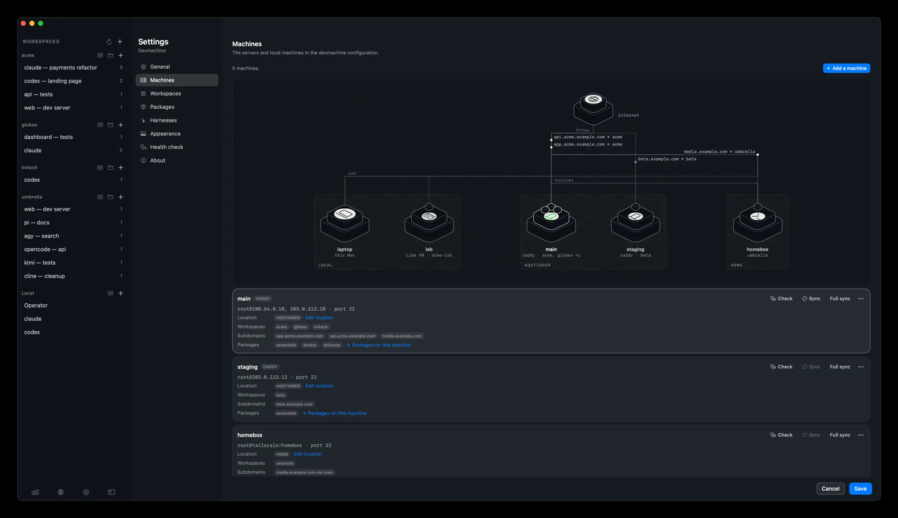
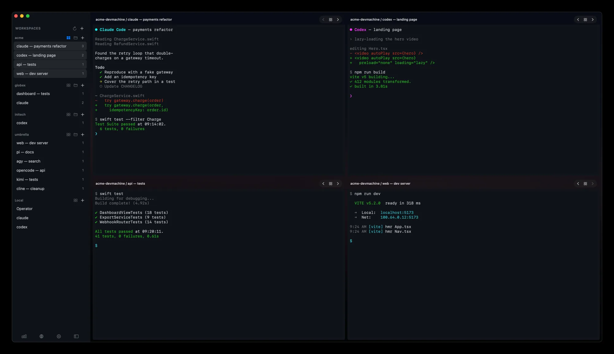

<h1 align="center">devmachine</h1>

<p align="center">
  <strong>Code from anywhere.</strong><br>
  Any machine you own. An isolated workspace for every project. No lock-in. Free.
</p>

<p align="center">
  <a href="https://mydevmachine.sh/">Website</a> ·
  <a href="https://mydevmachine.sh/getting-started/">Getting started</a> ·
  <a href="https://mydevmachine.sh/guides/">Guides</a> ·
  <a href="https://mydevmachine.sh/packages/">Packages</a> ·
  <a href="https://mydevmachine.sh/app/">Mac app</a> ·
  <a href="https://mydevmachine.sh/changelog/">Changelog</a>
</p>

<p align="center">
  <a href="https://github.com/mydevmachine/devmachine/releases/latest"></a>
  <a href="LICENSE"></a>
  
  
</p>

<p align="center">
  
</p>

devmachine turns a Debian, Ubuntu, Arch Linux or macOS machine into your own coding machine,
with one workspace per project. A VPS you rent, an old laptop, or a virtual
machine on your Mac: devmachine sets it up and locks it down. Each project
gets an isolated workspace with its own tech stack, logins and AI
subscription. Work from your terminal, a tablet over SSH, Claude Code on your
phone, or the Mac app.

- **Open source.** The CLI and every package are open source. Read them, fork
  them, change them.
- **No lock-in.** Underneath it is plain Linux or macOS, SSH and git. Stop using
  devmachine and your machines still work.
- **Extensible via packages.** Add a tool with one package, or write your own.
- **Your machines, your data.** A VPS you rent, a computer you already have,
  or a virtual machine of your own. Up to you.

## Quick start

On macOS or Linux, or Windows through WSL 2:

```sh
curl -fsSL https://mydevmachine.sh/install.sh | sh   # or: brew install mydevmachine/tap/devmachine
devmachine setup                                     # connect your machine and lock it down
devmachine skills add                                # work with your machines from any LLM session
devmachine workspaces new acme && devmachine sync    # add a workspace and build it
devmachine ssh acme                                  # step in
```

You need a machine running Debian, Ubuntu, Arch Linux or macOS that you
reach over SSH as root, or as an admin login with passwordless sudo. A Mac
needs Remote Login on and an admin login (root cannot log in there); `setup`
asks whether to use Homebrew or MacPorts and installs nothing until you say
yes. No server yet? `devmachine machines create-local dev` makes a virtual machine
on your own computer.

`setup` checks the machine's fingerprint, so you know you reached your own
machine. It installs a key only you have, turns off password logins, and
on Linux adds base tools, git, a firewall and Caddy. After `skills add`, any Claude
Code or Codex session can add packages, workspaces and sites for you.

Walk through it slowly in
[Your first devmachine, explained](https://mydevmachine.sh/guides/your-first-devmachine/),
or hand [the agent setup page](https://mydevmachine.sh/agent-setup/) to your
coding agent and let it do the work.

## What you get

- **One workspace per project.** Projects never see each other's files or
  tokens. One project breaking does not touch the others.
- **Work from any computer.** Your code lives on your machines. Open any
  workspace by name: `devmachine ssh acme`.
- **Agents ready to work.** Claude Code, Codex and your skills in every
  workspace. Pi, opencode, Antigravity CLI, Kimi Code and Cline are one
  package each.
- **Flexible at the core.** Install from existing packages or create your
  own. Keep it private or share it.
- **Put your site online.** Your app at app.example.com, with HTTPS, in one
  command: `devmachine expose add acme 3000 --host app.example.com`.
  devmachine points the name for you through Cloudflare or Hostinger.
- **Private until you publish.** Reach apps through `devmachine tunnel` or
  Tailscale. Only what you publish is public.
- **Locked down from the start.** No passwords, and no workspace runs as
  root.
- **Move to another machine.** Your whole setup is saved and versioned in
  git. Point it at a new machine and `sync`.
- **Build by day, run agents 24/7.** Every login opens inside tmux. Close the
  laptop and your agents keep working on the machine.

## What machine do I need

| | RAM | CPU | Disk | For |
| --- | --- | --- | --- | --- |
| A few apps | 8 GB | 2 vCPU | 100 GB | One or two apps and a coding agent. |
| **Recommended** | **16 GB** | **4 vCPU** | **200 GB** | Several apps and coding agents at once. |
| Full development | 32 GB | 8 vCPU | 400 GB | Docker and many intensive apps running together. |

An old laptop with Debian, Ubuntu or Arch Linux works too, and so does a Mac. Add the `tailscale` package
and you reach it from anywhere, even from outside your home. See
[Reaching your server](https://mydevmachine.sh/concepts/reaching-your-server/).

## The model

```
your computer ── ssh ──▶ machine (VPS, home server, Lima VM, or this computer)
                          ├── workspace acme    → claude-code, docker, github login
                          ├── workspace globex  → codex, postgres
                          └── workspace umbrella → wuzapi, published at api.example.com
```

- A [**machine**](https://mydevmachine.sh/concepts/machines-and-workspaces/)
  is a server the CLI reaches over SSH, or your own computer.
- A [**workspace**](https://mydevmachine.sh/concepts/machines-and-workspaces/)
  is one account on one machine. Its name is all you type.
- A [**package**](https://mydevmachine.sh/concepts/packages/) adds one thing:
  a coding agent, Docker, a GitHub login, a reverse proxy. `sync` installs
  the packages your configuration asks for. Browse the ready-made ones at
  [mydevmachine/packages](https://github.com/mydevmachine/packages), or
  [write your own](https://mydevmachine.sh/reference/package-format/).

Your configuration lives in `~/.config/devmachine`, a folder you control.
Nothing personal is part of this repository, and nothing runs on the server
between commands.

## Devmachine for Mac

<p align="center">
  
</p>

An optional macOS app on top of the same CLI and configuration. Open sessions
in a grid, see the network map of your machines, publish a port in a few
clicks, and watch RAM, disk and agent usage from one window.

[See the app](https://mydevmachine.sh/app/) ·
[Download the .dmg](https://github.com/mydevmachine/app-releases/releases/latest/download/Devmachine.dmg) ·
`brew install --cask mydevmachine/tap/devmachine-app`

## Guides

Real setups, done in a few steps, by hand or as one request to your agent.
[See them all](https://mydevmachine.sh/guides/).

| Agents | Web apps | Workspaces and networking |
| --- | --- | --- |
| [Keep your sessions running](https://mydevmachine.sh/guides/keep-sessions-running/) | [Express site with TLS](https://mydevmachine.sh/guides/express-site-with-tls/) | [One consultant, three startups](https://mydevmachine.sh/guides/one-consultant-three-startups/) |
| [Claude Code from your phone](https://mydevmachine.sh/guides/claude-code-remote-control/) | [Docker site on 8080](https://mydevmachine.sh/guides/docker-site-on-8080/) | [Try it on your computer with Lima](https://mydevmachine.sh/guides/a-local-vm-with-lima/) |
| [Claude 24/7 in Telegram](https://mydevmachine.sh/guides/claude-24-7-in-telegram/) | [Home server without port forwarding](https://mydevmachine.sh/guides/expose-home-server-without-port-forwarding/) | [Point your domain with Cloudflare](https://mydevmachine.sh/guides/cloudflare-dns/) |
| [OpenClaw in its own sandbox](https://mydevmachine.sh/guides/openclaw-in-its-own-sandbox/) | [wuzapi as your own package](https://mydevmachine.sh/guides/wuzapi-as-your-own-package/) | [Your own Tailscale with Headscale](https://mydevmachine.sh/guides/headscale/) |
| [Hermes Agent in its own sandbox](https://mydevmachine.sh/guides/hermes-agent-in-its-own-sandbox/) | [Agno AgentOS with a control plane](https://mydevmachine.sh/guides/agno-agentos-with-control-plane/) | [Logins and secrets](https://mydevmachine.sh/guides/logins-and-secrets/) |

## Documentation

All of it is at **[mydevmachine.sh](https://mydevmachine.sh/)**. The same
pages live in [`docs/`](docs/index.md), and an LLM can read them in one file
at [llms-full.txt](https://mydevmachine.sh/llms-full.txt).

- [Getting started](https://mydevmachine.sh/getting-started/) — install, connect a server, see it work.
- [Concepts](https://mydevmachine.sh/concepts/machines-and-workspaces/) — machines, workspaces, packages, DNS, publishing, private networks.
- [How it works](https://mydevmachine.sh/how-it-works/ssh/) — the reasons behind choices that are not obvious from the outside.
- [Commands](https://mydevmachine.sh/reference/commands/) — every command, its flags and its output.
- [Troubleshooting](https://mydevmachine.sh/troubleshooting/) — errors you may see, and what they really mean.
- [Changelog](https://mydevmachine.sh/changelog/) — what changed in each release.

## From source

```sh
git clone https://github.com/mydevmachine/devmachine.git
cd devmachine && make build && ./devmachine help
```

Working on the CLI itself: [development](docs/development.md) and
[releasing](docs/releasing.md). Issues and pull requests are welcome.

## Licence

MIT. See [LICENSE](LICENSE).
