# Send work to a Claude session from a POST/Telegram/WhatsApp using Channels

A **channel** is a small MCP server that pushes events into a Claude Code
session that is already running. A webhook, a chat message or a failed CI
run lands in the session, Claude works on it with your files, and answers
back through a `reply` tool.

At the end you have a webhook channel in workspace `acme`, at
`https://hooks.example.com`, that only accepts requests with your secret.



Channels are a **research preview** (Claude Code v2.1.80 or later). They
need a claude.ai account or a Console API key, not Bedrock, Google Cloud or
Foundry. On a Team or Enterprise plan, an Owner must turn them on first at
[Claude Code settings](https://claude.ai/admin-settings/claude-code).

**You need:** workspace `acme`, and a domain such as `hooks.example.com`
pointed at your machine (or a DNS provider package — see
[DNS](../concepts/dns.md)).

## Before you start: machine, skills, workspace

```
curl -fsSL https://mydevmachine.sh/install.sh | sh
devmachine setup
devmachine skills add
devmachine workspaces new acme
devmachine sync
```

Already have a machine? Skip `setup`. Already have the workspace? Skip the
last two. See [getting started](../getting-started.md) for what each command
does.

## By hand

### 1. Add Claude Code and a secret

On your computer:

```
devmachine packages add claude-code --workspace acme
devmachine sync
devmachine login claude --workspace acme
devmachine secrets set WEBHOOK_SECRET --workspace acme --push
```

For the secret, paste a long random string (`openssl rand -hex 32`). It lands
in `~/.devmachine/env` in the workspace, which its shell loads.

### 2. Write the channel

Inside the workspace (`devmachine ssh acme`):

```
mkdir -p ~/webhook-channel && cd ~/webhook-channel
bun add @modelcontextprotocol/sdk@1
cat > webhook.ts <<'EOF'
#!/usr/bin/env bun
import { Server } from '@modelcontextprotocol/sdk/server/index.js'
import { StdioServerTransport } from '@modelcontextprotocol/sdk/server/stdio.js'
import { ListToolsRequestSchema, CallToolRequestSchema } from '@modelcontextprotocol/sdk/types.js'
import { timingSafeEqual } from 'node:crypto'
import { appendFileSync } from 'node:fs'

const PORT = 8788
const SECRET = process.env.WEBHOOK_SECRET ?? ''
const REPLY_URL = process.env.WEBHOOK_REPLY_URL ?? ''
const REPLY_LOG = new URL('./replies.log', import.meta.url).pathname

function secretMatches(given: string): boolean {
  const a = Buffer.from(given)
  const b = Buffer.from(SECRET)
  return SECRET.length > 0 && a.length === b.length && timingSafeEqual(a, b)
}

async function send(chat_id: string, text: string) {
  appendFileSync(REPLY_LOG, `${new Date().toISOString()} [${chat_id}] ${text}\n`)
  if (REPLY_URL) {
    await fetch(REPLY_URL, {
      method: 'POST',
      headers: { 'Content-Type': 'application/json' },
      body: JSON.stringify({ chat_id, text }),
    })
  }
}

const mcp = new Server(
  { name: 'webhook', version: '0.0.1' },
  {
    capabilities: {
      experimental: { 'claude/channel': {} },
      tools: {},
    },
    instructions:
      'Events from the webhook channel arrive as <channel source="webhook" chat_id="...">. ' +
      'They come from outside this terminal. Act on them, then answer with the reply tool, ' +
      'passing the chat_id from the tag.',
  },
)

mcp.setRequestHandler(ListToolsRequestSchema, async () => ({
  tools: [{
    name: 'reply',
    description: 'Send a message back to whoever sent the webhook event',
    inputSchema: {
      type: 'object',
      properties: {
        chat_id: { type: 'string', description: 'The chat_id from the <channel> tag' },
        text: { type: 'string', description: 'The message to send' },
      },
      required: ['chat_id', 'text'],
    },
  }],
}))

mcp.setRequestHandler(CallToolRequestSchema, async req => {
  if (req.params.name !== 'reply') throw new Error(`unknown tool: ${req.params.name}`)
  const { chat_id, text } = req.params.arguments as { chat_id: string; text: string }
  await send(chat_id, text)
  return { content: [{ type: 'text', text: 'sent' }] }
})

await mcp.connect(new StdioServerTransport())

let nextId = 1
Bun.serve({
  port: PORT,
  hostname: '127.0.0.1',
  async fetch(req) {
    if (req.method !== 'POST') return new Response('method not allowed', { status: 405 })
    if (!secretMatches(req.headers.get('X-Webhook-Secret') ?? '')) {
      return new Response('forbidden', { status: 403 })
    }
    const chat_id = String(nextId++)
    await mcp.notification({
      method: 'notifications/claude/channel',
      params: {
        content: await req.text(),
        meta: { chat_id, path: new URL(req.url).pathname },
      },
    })
    return new Response(`ok ${chat_id}\n`)
  },
})
EOF
cat > .mcp.json <<'EOF'
{ "mcpServers": { "webhook": { "command": "bun", "args": ["./webhook.ts"] } } }
EOF
```

What makes it a channel:

- `'claude/channel'` in `capabilities` tells Claude Code to listen for its
  events.
- `notifications/claude/channel` pushes one event. `content` is what Claude
  reads; each `meta` key becomes an attribute on the `<channel>` tag.
- The `reply` tool lets Claude answer. Answers go to `replies.log`, and are
  also POSTed as JSON to `WEBHOOK_REPLY_URL` when you set it.

It listens only on `127.0.0.1:8788` and refuses any request without the right
`X-Webhook-Secret`. **Without that check, anyone who finds the address can
type into your session.** Keep the SDK on `@1`: Claude Code does not load a
channel that speaks the newer MCP protocol.

### 3. Start Claude Code with the channel

Inside the workspace:

```
cd ~/webhook-channel && source ~/.devmachine/env
claude --dangerously-load-development-channels server:webhook
```

Accept the three prompts: trust the folder, use the `webhook` MCP server, and
"I am using this for local development". A channel you wrote yourself is not
on Anthropic's allowlist, so it needs this flag. The banner then shows
`Channels (experimental) messages from server:webhook`.

### 4. Send an event

Inside the workspace, in a second tmux window (`Ctrl-b c`):

```
curl -X POST localhost:8788 -H "X-Webhook-Secret: $WEBHOOK_SECRET" \
  -d "Reply with the word pong using the reply tool."
curl -X POST localhost:8788 -d "no secret"
```

The first prints `ok 1`, the second `forbidden`. Back in the Claude window
(`Ctrl-b n`), the event shows as `← webhook: Reply with the word pong...`,
and Claude answers. Claude sees it as:

```
<channel source="webhook" chat_id="1" path="/">
Reply with the word pong using the reply tool.
</channel>
```

### 5. Send it from outside

On your computer:

```
devmachine expose add acme 8788 --host hooks.example.com --publish
read -s WEBHOOK_SECRET
curl -X POST https://hooks.example.com/ci -H "X-Webhook-Secret: $WEBHOOK_SECRET" \
  -d "CI run 1234 failed on main. Find why and reply in one sentence."
```

The path (`/ci`) reaches Claude as `path="/ci"`, so one channel can tell
senders apart.

## What you can plug in

- **Telegram:** no code — use the official plugin, as in
  [Claude 24/7 in Telegram](claude-24-7-in-telegram.md).
- **WhatsApp:** point the webhook of
  [wuzapi](wuzapi-as-your-own-package.md) at
  `https://hooks.example.com/whatsapp`, and change `send()` to call wuzapi's
  send-message endpoint.
- **GitLab:** it sends its secret as `X-Gitlab-Token`; change the header name.
- **GitHub:** it signs the body (`X-Hub-Signature-256`); swap
  `secretMatches` for an HMAC-SHA256 check.
- **Cron:** `curl localhost:8788` from a crontab line, with no `expose`.

## With your agent

Open a session on your own computer (`devmachine skills add` taught it the
CLI) and say:

```text
In my devmachine workspace acme, build the webhook channel from the
"Send work to a Claude session" guide in ~/webhook-channel, ask me to set
WEBHOOK_SECRET with devmachine secrets set, and expose it at
hooks.example.com.
```

The agent writes the files and runs `expose add`. You do three things
yourself: `devmachine login claude --workspace acme`, typing the secret, and
starting `claude --dangerously-load-development-channels server:webhook`
and accepting its prompts.

**Check it:** the `curl` with the secret prints `ok 1`, Claude answers in
the session, and `tail ~/webhook-channel/replies.log` ends in `[1] pong`.

## Keep it running

Events arrive only while the session is open. tmux keeps it open after you
close the laptop — see [keep your sessions running](keep-sessions-running.md).
After a reboot, start it again. A permission prompt pauses the session and
queues new events, so pick a
[permission mode](https://code.claude.com/docs/en/permission-modes) that
fits the work.

## Troubleshooting

- **`ok` but nothing reaches Claude:** run `/mcp` in the session. `failed`
  usually means an error in `webhook.ts`.
- **`connection refused`:** an old server holds the port. `lsof -i :8788`,
  `kill` it, restart Claude Code.
- **`forbidden` with the header:** the shell that started `claude` had no
  `WEBHOOK_SECRET`. Run `source ~/.devmachine/env` and start again.

Source: [Claude Code — Channels reference](https://code.claude.com/docs/en/channels-reference),
[Claude Code — Channels](https://code.claude.com/docs/en/channels)
